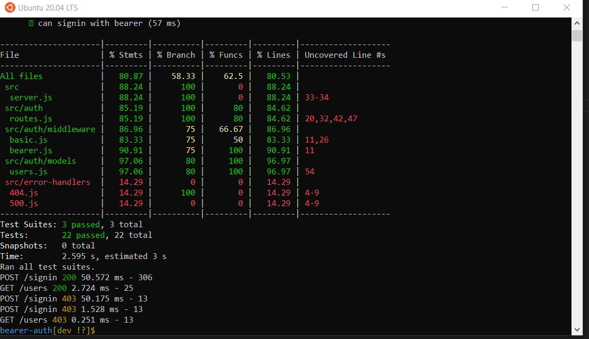
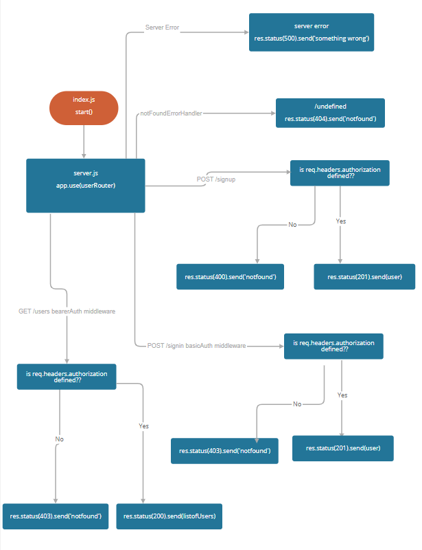

# bearer-auth

[heroku](https://khamees-bearer-auth.herokuapp.com/api)

[PR](https://github.com/mohammed-khamees/bearer-auth/pull/1)

[tests report](https://github.com/mohammed-khamees/bearer-auth/actions)

## how to work with this repo:

1. `npm init -y`
2. `npm i express dotenv cors morgan mongoose bcrypt base-64 jsonwebtoken`
3. `npm i -D jest @code-fellows/supergoose`

- create .env file and added :
  PORT=3000
  MONGODB_URI=<% your mongon uri %>
  SECRET=<% your json web token secret key %>

## Run the code:

- npm start
- Endpoints:
  POST /signin return the auth user
  POST /signup return the new user
  GET /users return list of the users in the mongodb
  GET /secret return "Welcome to the secret area!"

**On the `package.json` change the `script` to**

```
"scripts": {
    "start": "node index.js",
    "watch": "nodemon index.js",
    "test-watch": "jest --watchAll",
    "test": "jest"
  },

```




